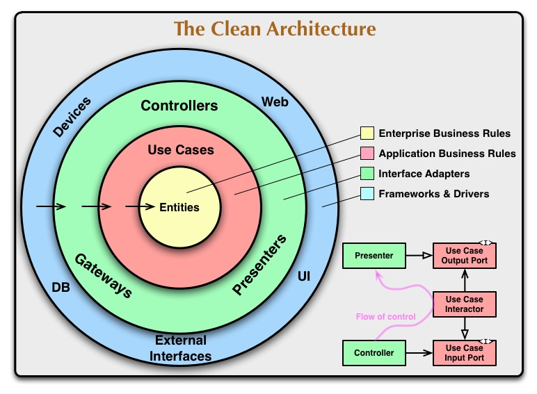

# microservices-skeleton

## Clean architecture
### The goal of this project is to make Uncle Bob proud, eventually!

## Menu-service
### Provides a REST API for managing a portuguese restaurant menu
#### Disclaimer: It will only work if the restaurant is Portuguese
**TechStack:** Springboot, SpringData JPA, PostgreSQL